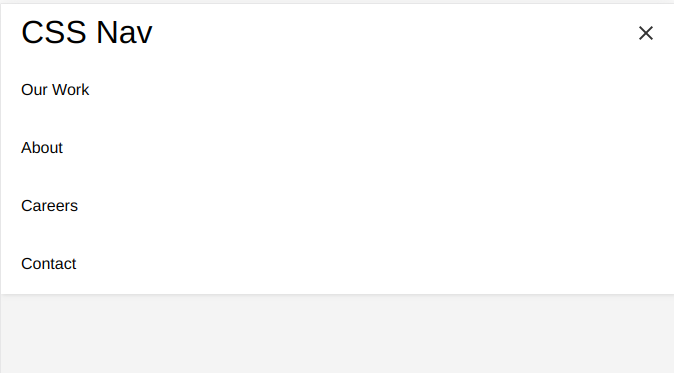
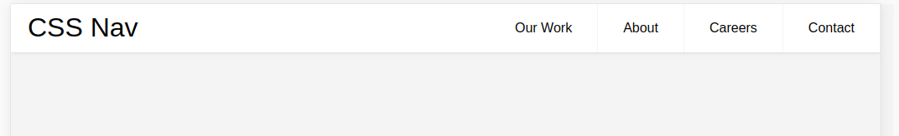
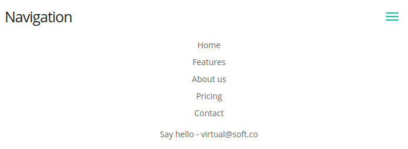
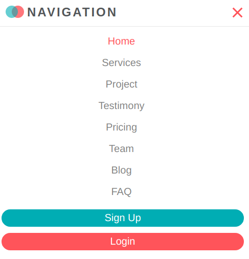
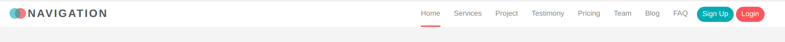

# code-snippets
### coding snippets for commonly used by Web Developers
# Navigation
### Nav-1
#### Mobile view 
 
 
#### Full view #
 
 
 ### Nav-2 
 
 #### Mobile view 
 
 
 ### Full view #
 
 
 ### Nav-3
 
 #### Mobile view 
 
 
 ### Full view #
 
