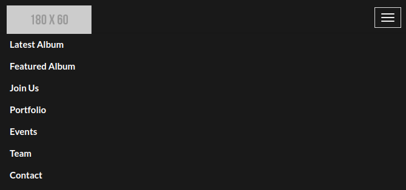
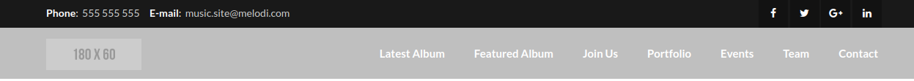

# Code-snippets
### Coding snippets for commonly used by Web Developers
# Navigation
### Nav-1
***
#### Mobile view 
 
 
#### Full view #
 

 ### Nav-2 
 ***
 #### Mobile view 
 
 
 ### Full view #
 
 
 ### Nav-3
 ***
 #### Mobile view 
 
 
 ### Full view #
 
 
 ### Nav-4
 ***
 #### Mobile view 
 
 
 ### Full view #
 
 
  ### Nav-5
 ***
 #### Mobile view 
 
 
 ### Full view #
 
 
  ### Sidebar-Navigation
 ***
 #### Mobile view 
 

